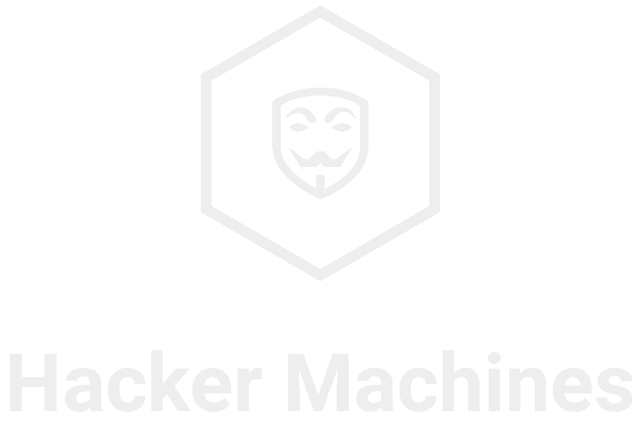

<!-- PROJECT LOGO -->
<br />
<div align="center">
  <a href="https://github.com/othneildrew/Best-README-Template">
    
  </a>
</div>

## About The Project
This end-of-degree project consists of a web platform to learn cybersecurity that has been given the name of Hacker Machines, in which the learning process
consists of carrying out different cyber challenges that registered users will have to solve the system.

These challenges are virtual machines that are running in a controlled environment within an internal network developed for this purpose. The challenges are specially created to be hacked since they have a series of vulnerabilities that must be exploited. In order for users to connect to these virtual
machines, they must connect through a VPN to this internal network.

Once the user is ready to solve the challenge, they are provided with the IP address to which they have to start performing an analysis in search of different vulnerabilities in order to find faults in that system, once they take advantage of those faults they should find the different solutions that must be introduced on the platform, this will make the user earn points , which will accumulate, thus creating a ranking with all users.

## Screenshots


## Architecture
To build the virtual environment in which the challenges are executed, the Oracle Virtual Box software has been used, where the first thing that has to be done is to create an internal network with the respective configuration of the Virtual Box DHCP server. Once this is done, a virtual machine is created with an Ubuntu Server, which will carry out the communication process between the virtual network and the outside, for this this server is configured with two network interfaces, so that one of them is connected with the internal network of the challenges and the other is connected to the outside, in this way anyone who wants to connect to the internal network has to go through this Ubuntu Server first.
 
As you can see, both the web server and the OpenVPN server run inside a virtual machine that is inside said network. The challenges that will be on the platform are downloaded from the VulnHub platform as .ova files, once downloaded they are imported into Virtual Box, then they are configured to run within the internal network.

## Setup

Before execute the app you need to install a docker container with the OpenVPN server

```bash
OVPN_DATA="hacker-machines-openvpn"
docker volume create --name $OVPN_DATA
docker run -v hacker-machines-openvpn:/etc/openvpn --rm kylemanna/openvpn ovpn_genconfig -u udp:<Server IP>
docker run -v hacker-machines-openvpn:/etc/openvpn --rm -it kylemanna/openvpn ovpn_initpki
docker run -v hacker-machines-openvpn:/etc/openvpn -d -p 1194:1194/udp --cap-add=NET_ADMIN kylemanna/openvpn
```

Then you need to install the requeriments following the next command
```bash
python3 -m pip install -r requeriments.txt
```
Finally we can run the application by executing the following command
```bash
python3 manage.py runserver
```

## License
[MIT](https://choosealicense.com/licenses/mit/)
